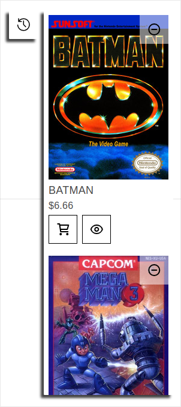
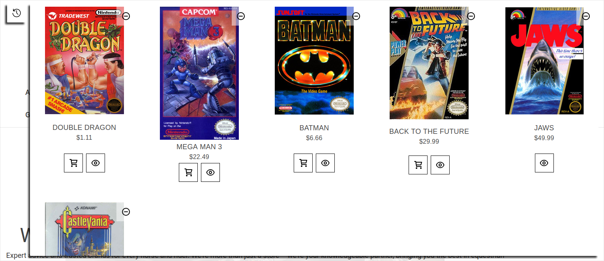

# Recently Viewed




## What is Recently Viewed

The "Recently Viewed" addon allows guests on the site to keep track of the products they've looked at over the course of their visit.

## Installation

- Pull the included `assets` and `templates` folders into your theme.

### JavaScript
- Import the `rec-view.js` file into `global.js`

    `global.js`
    ```javascript
    import recView from './custom/rec-view';
    ```

- Call the Recently Viewed code:

    `global.js`, paste the following at the bottom of the `onReady()` method:
    ```javascript
    recView(this.context);
    ```

- Configure Rec View settings (optional):

    ```js
    const settings = {
        productsMin: 1, // Minimum number of products view before RV widget appears
        productsMax: 3, // Maximum number of products to show in RV widget
        allProductsMax: 50 // Maximum number of products to load in RV widget
    }
    ```

### Handlebars
- Call the component in `base.html` beneath the header component:

    ```handlebars
    {{> components/custom/rec-view }}
    ```

### SCSS
- Import the included `_its_rec-view.scss` stylesheet into `theme.scss`.

    ```scss
    @import 'custom/rec-view';
    ```

- Test the component by clicking through different product pages and make sure it's picking up products and the View All Products button works
